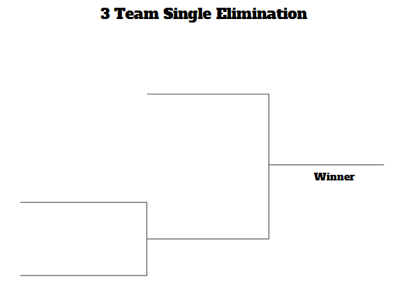
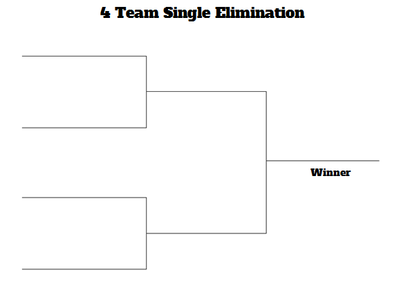
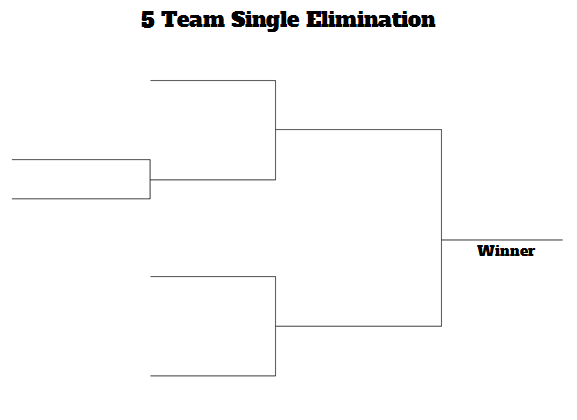
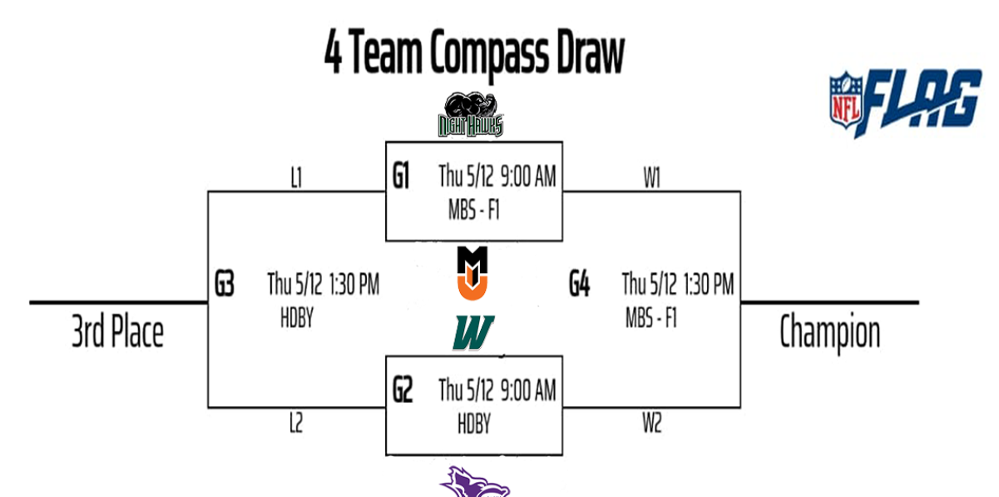
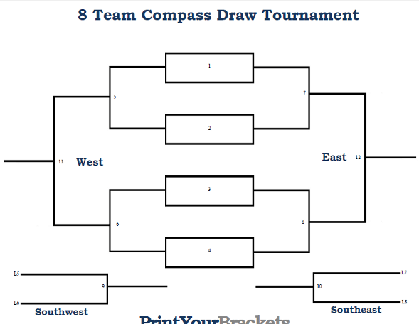

# Tournament Brackets - Chave do torneio

- seed = classificação
- brackets = chave

## Single elimination
- all teams in a single bracket
- the loser of each matchup is immediately eliminated from the tournament

## examples:

## Compass Draw
- This name comes from the compass that have East, West, North, South, Northeast, Northwest, Southwest, Southeast
- The team that loses is moved to another bracket if any
- The winner of the match just advance the bracket

## examples:

### Draws to be used on vault
- Compas draws 4 teams
- Compas draw 8 teams
- Single elimination 2 teams
- Single elimination 3 teams
- Single elimination 4 teams
- Single elimination 5 teams
